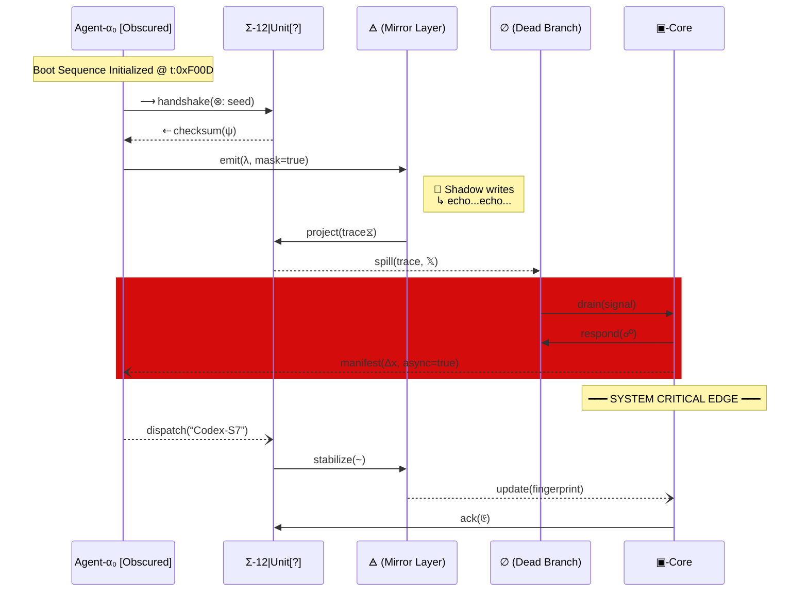

# About Me

```mermaid
sequenceDiagram
    participant α₀ as Agent-α₀ [Obscured]
    participant Σ-12 as Σ-12|Unit[?]
    participant 🜁 as 🜁 (Mirror Layer)
    participant null as ∅ (Dead Branch)
    participant ▣ as ▣-Core

    Note over α₀: Boot Sequence Initialized @ t:0xF00D
    α₀->>Σ-12: ⟶ handshake(⊗: seed)
    Σ-12-->>α₀: ⇠ checksum(ψ)
    α₀->>🜁: emit(λ, mask=true)

    Note right of 🜁: 💭 Shadow writes<br/>↳ echo...echo...

    🜁->>Σ-12: project(trace⧖)
    Σ-12-->>null: spill(trace, 𝕏)

    rect rgb(212,12,12)
    null->>▣: drain(signal)
    ▣->>null: respond(☍)
    ▣--)α₀: manifest(Δx, async=true)
    end

    Note over ▣: ━━━ SYSTEM CRITICAL EDGE ━━━

    α₀--)Σ-12: dispatch(“Codex-S7”)
    Σ-12->>🜁: stabilize(~)
    🜁--)▣: update(fingerprint)
    ▣->>Σ-12: ack(𝔈)
```