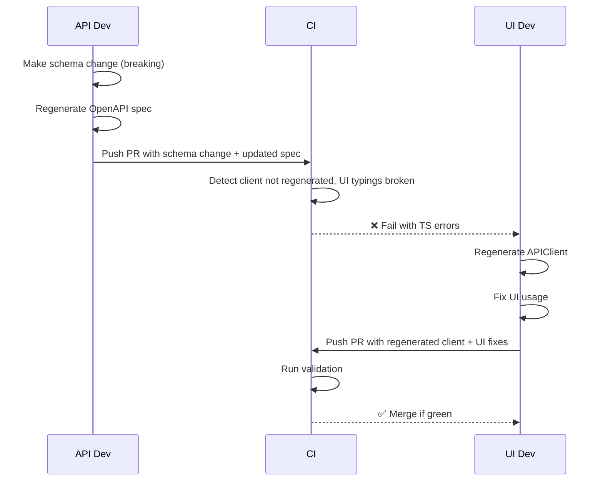

# Branching & Collaboration

The purpose of this guide to outline the process which works for small/medium scale teams - squads.

## Values

- Short-liven branches only. It is much easier, but comes with tradeoffs
- Not breaking the key branches (MAIN, DEV, any other branches)
- Low cognitive load
- Fast iterations
- Enable collaboration, reduce blockers

## Branches

- `main` - everything goes there
- `dev` - 
- `releases`

## Problem: Cross-service dependencies

When multiple engineers are working on the same repository, but on different elements of the system it might create an event of deadlock. We are seeing it quite often in API+UI tech stacks:
- UI is waiting for API
- API is waiting for any preferences from UI
- API is changed, now UI is broken
- API has made a new version of API (v2), UI didn't update to it hence not seeing any changes or getting any benefits

How should it be solved? First, acknowledge the fact: if you are working in the same repository, both services release management is bound. Yet, it is bound to get benefits: faster iteration, less repositories juggle, related changes are released at once. There are quite a few options to make it smooth:

- **Split the repository**. Simple answer. The trade-off is that when you want to release the both services (API and UI, for example) or work on both at the same time - it puts an additional pressure on developer, increases cognitive load - that is the **cost**.
- **Create a new API version**. Now, you will have both old and new versions, which have to be maintained. Time to copy-paste the tests, ensure backward compatibility, and control to ensure UI will upgrade to the new version on time. That might seem to be the "right" approach, but it also comes with the **cost** - cognitive load, time, inconvenience and quite often - embarrassment.
- **Break the UI**, don't merge until it will get fixed. No additional waste, but it increases the lifespan of the branch, which contradicts the value we are chasing - "short-lived branches". That is the **cost**.

In a squad with healthy relationships, the first 2 approaches will introduce inconvenience and additional time on the iteration. Use 3rd approach, but take into account: how soon should delivery occur, how many integrations consuming your API.

Keep in mind - no matter the approach you will take, quite often you cannot ship it - why bother?

### Illustrated

We will use the good-old example - Web App development.

Those 3 rules simulate all the key combinations:

- **API Engineer**: Owns schema stability and backend delivery.  
- **UI Engineer**: Depends on reliable APIClient. Frontend delivery owner.  
- **Fullstack Engineer**: Owns both ends. Can collapse handoffs.  

Scenario:

<!-- 

## Built-in Safeguards

### Monorepo Advantages

- UI + API changes combined in a single PR  
- Tight feedback loop reduces handoff delays

### Pre-commit Defenses

- `generate-openapi.sh`  
- `generate-api-client.sh`  
- `lint && test` hooks  

### CI Defenses

- Block merges if OpenAPI spec changed without regenerating client  
- Block merges on TypeScript errors in `@api-client/*`  
- Run `prettier`, `eslint`, `mypy`, and other quality checks  

## Acceptance Criteria (READY for PR)

- Schema changed? → Client regenerated  
- TS errors? → Fixed or excluded  
- UI affected? → Code updated  
- CI passes? → ✅ Merge allowed  

##  BA Notes for Continuous Discovery

- Document API-to-UI expectations early  
- Capture dependencies when writing stories  
- Use roles in discovery to anticipate which roles will be blocked by which change  
- Always define testable output: regenerated client, updated usage, working UI -->